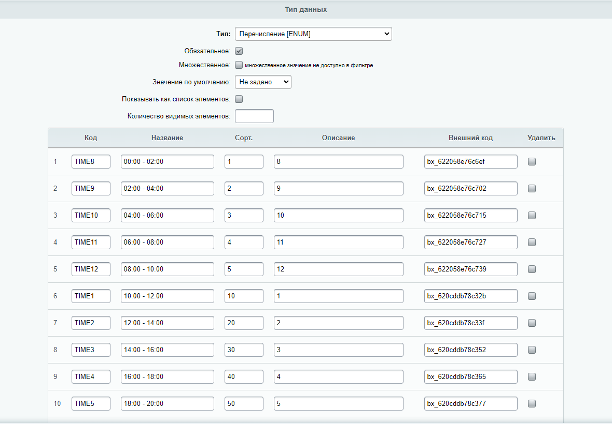
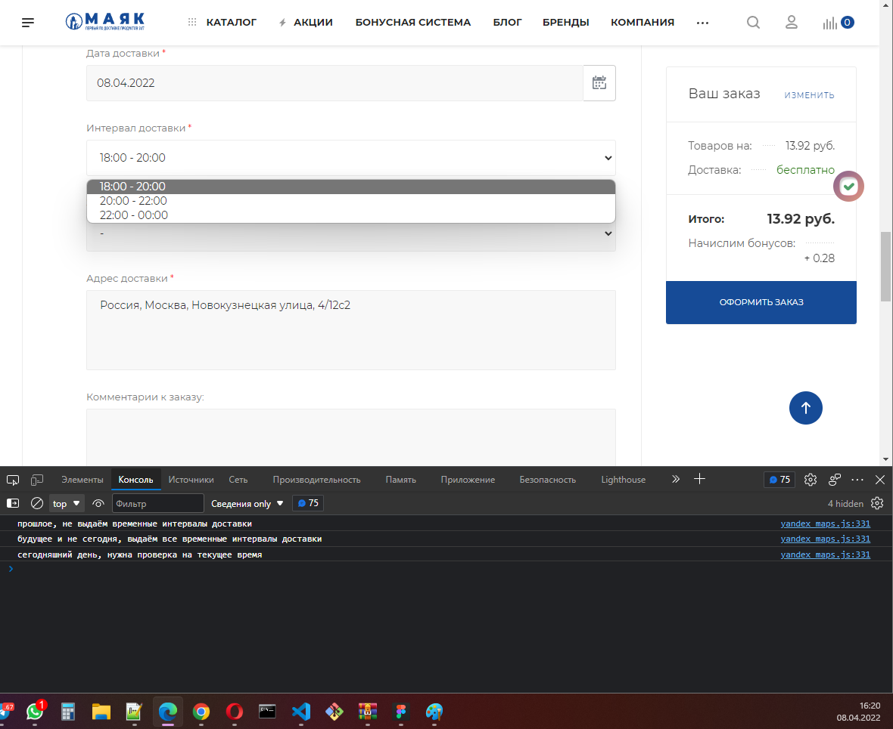

# delivery-info

> **commercial development**

The script of the checkout page in the [Mayak](https://mayak.art) online store. 
Hides unnecessary parameters "on the fly" in the frontend.

### Task 
Limitation of delivery time intervals depending on the selected date and current time. 
Changing styles and behavior of controls.

### Features 
- determination of the selected date in one input and change in another
- dates - conversion for correct comparison
- events - subscription to control events
- DOM editing

### Admin panel

### Console

